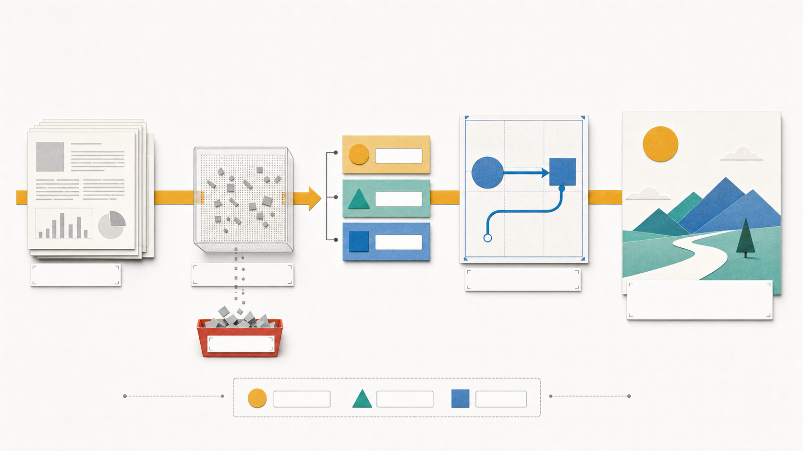

# Agent Evidence Illustrations

> A skill for audit-office style illustrations about agents, evidence chains, trust boundaries, and handoffs.

Agent Evidence Illustrations is a narrower visual skill for AI agent articles where the hard part is evidence: who claimed what, which artifact proves it, where permission stops, and what a reviewer can replay.

## Examples

<p><br><sub>Audit office trust gate</sub></p>
<p><br><sub>Article pipeline</sub></p>

## What It Does

- Turn trust boundaries, agent handoffs, review queues, replay tapes, and permission gates into body figures.
- Use an original audit-office metaphor world with stamps, trays, slips, evidence tape, and numbered badges.
- Keep illustrations readable for Chinese technical and product writing.
- Avoid copying mascot/IP systems from other repositories.

## Install

Clone this repository into your local Codex skills folder:

```bash
mkdir -p ~/.codex/skills
git clone https://github.com/Alexsun1one/agent-evidence-illustrations.git ~/.codex/skills/agent-evidence-illustrations
```

If your agent expects a nested skill directory instead of a direct clone, copy the folder that contains `SKILL.md` into its skills directory.

## Use

Example request:

```text
Use agent-evidence-illustrations to create one article body figure about an AI agent handoff, an evidence trail, and a reviewer approval gate.
```

The skill entry point is [`SKILL.md`](SKILL.md). Supporting rules live in [`references/`](references/) when this repo includes them; helper scripts live in [`scripts/`](scripts/) when available.

## Quality Bar

- The image must explain a concrete idea, not merely decorate the page.
- Chinese text should be readable at the actual publishing size.
- The output should keep a stable style system across a set while letting each image fit its topic.
- Generated examples are prompts and visual references, not fixed templates.

## WeChat

More writeups, examples, and AI workflow notes are published on my WeChat official account. This is the real QR/search card used for the account, included as a normal bitmap asset rather than a stylized fake code.

<p align="center">
  
</p>

## License

MIT. See [`LICENSE`](LICENSE).

## Notice

This is an original open-source skill package by Sun Wuyuan / Alexsun1one. It is not affiliated with OpenAI, GitHub, WeChat, or any referenced platform. Avoid using it to imitate protected characters, living artists, or third-party brand assets without permission.
